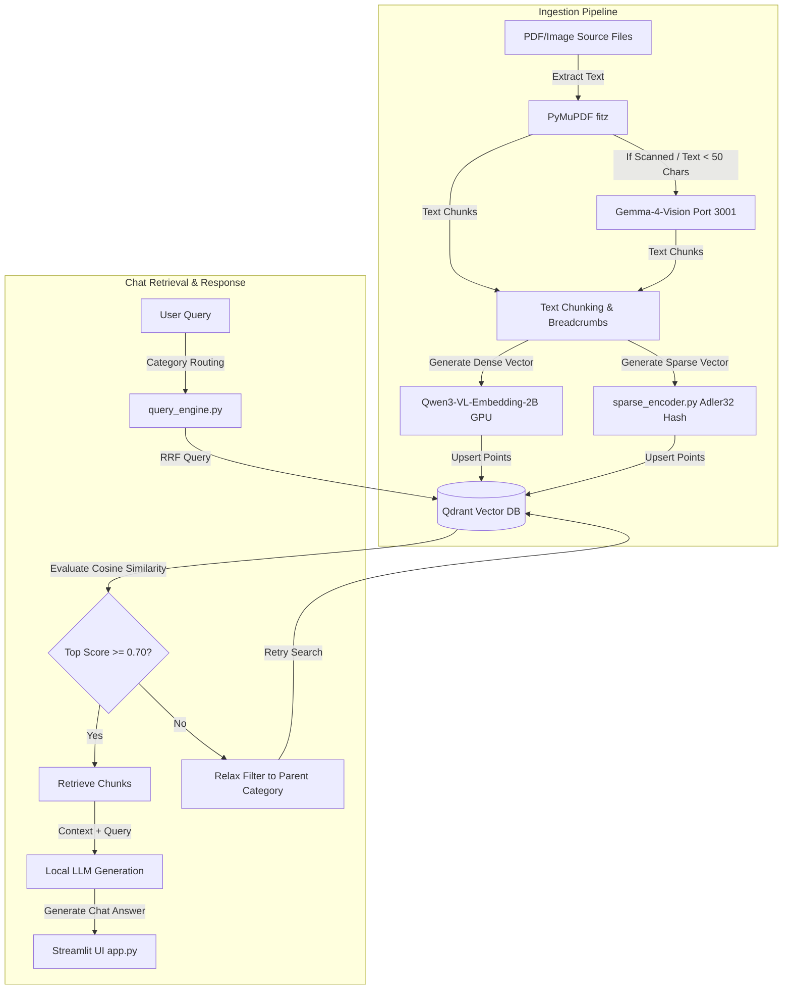

# Conversational RAG Chatbot: Localized Civil Services Rule Assistant

An automated, incremental Retrieval-Augmented Generation (RAG) system with a localized semantic search pipeline, dynamic LLM-based categorization, real-time directory automation, and conversational reasoning for Government Civil Services guidelines.

---

## 📋 Problem Statement & Dataset Details (PS ID: RAG-CS-001)

### **Problem Statement ID**: `RAG-CS-001`
### **Project Title**: Localized Conversational AI & Directory Automation for Civil Service Guidelines

### **Problem Description**
Administrative personnel in government departments routinely verify and cross-reference queries against a massive, complex, and continuously updated collection of guidelines, circulars, office memorandums, and financial rules. 
1. **Manual search latency**: Finding specific clauses in hundreds of multi-page manuals (some exceeding 100MB, like the GFR or CPWD manuals) wastes significant time.
2. **Hallucination risks**: General-purpose cloud LLMs are prone to hallucinations, cannot access local/sensitive directives, and pose security risks if internal documents are uploaded to public servers.
3. **Re-indexing overhead**: Traditional RAG systems require re-indexing the entire document corpus from scratch whenever a single file is added or modified, which is highly inefficient for large document directories.

### **Key Solution Objectives**
* **Local Processing**: Keep all computations, embeddings, and database storage entirely offline on CPU/local hardware.
* **Conversational flow with context retention**: Resolve follow-up queries by dynamically keeping track of historical message context.

---

## 📊 A. Dataset for the Problem Statement

The dataset consists of three structured components covering AI (RAG corpus), Analytics (Performance logs), and Automation (Workflows).

### 4.1 AI Dataset: Document Corpus (Hierarchically Labeled)
*   **Format**: PDF and Image files (government circulars, OMs, and manuals).
*   **Type**: Unlabeled raw text corpus with **directory-based hierarchical labeling**.
*   **Size**: 514 documents (~6,500+ chunk points in vector space).
*   **Description**: Organized into a strict, two-tier folder tree. During ingestion, each chunk is annotated with metadata breadcrumbs representing its category.

### 4.2 Analytics Dataset: Query & Performance Log Database
*   **Format**: Tabular / JSON structure.
*   **Type**: Labeled performance logs.
*   **Description**: Tracks:
    *   Query execution latency (target: < 4 seconds).
    *   Retrieval similarity scores (Cosine distance) used for dynamic routing evaluations.
    *   Ensemble scoring logs (RRF rank lists) showing reciprocal ranks of matched chunks.
    *   System CPU/GPU utilization logs and VRAM memory footprint.

### 4.3 Automation Data & Workflow Details
*   **Functional Requirements**:
    1.  **Single-Command Execution**: Execute `python run_pipeline.py --skip-scrape --skip-clean --start-server` to run the entire pipeline end-to-end.
    2.  **LLM-Based Segregation**: Auto-classify unsorted files using zero-shot inference (Sarvam-105B).
    3.  **Vision OCR Fallback**: Auto-transcribe scanned PDFs (Gemma-4-Vision) if digital characters < 50.
    4.  **Database Rebuild Integrity**: Safely delete the SQLite database lock before indexing.
*   **Workflow Steps**:
    1.  *Scan Phase*: Traverses `documents/` recursively.
    2.  *OCR Check*: Extracts text; falls back to Port 3001 if page is an image.
    3.  *Embedding & Hashing*: Generates 2048-dim dense embeddings (Qwen3) and Adler32 sparse hashes.
    4.  *Qdrant Upsert*: Commits dual-vector payloads to local storage.
    5.  *Host Server*: Launches Streamlit server on Port 8501.

---

## 🏗️ 2. High-Level Architecture



---

## 📂 3. Document Directory Layout

```text
documents/
├── 1_Central_Procurement_Commission/
│   ├── Procurement_Guidelines_&_GFR       # GFR directives
│   ├── Tenders_&_Bidding                 # Tender notices, NITs
│   └── GeM_&_Contracts                   # GeM portal circulars, contract terms
├── 2_Finance/
│   ├── Demands_for_Grants                # Detailed Demands for Grants sheets
│   ├── Accounts_&_Audits                 # Ledger books, reconciliation
│   ├── General_Expenditure               # Fund releases, non-plan sanctions
│   └── Pay_&_Increments                  # Pay fixation, matrices, increments
└── 3_Personnel/
    ├── Recruitment_&_Selection           # Vacancies, Direct Recruitment, UPSC
    ├── Vigilance_Conduct_&_Discipline    # Charge sheets, CVC inquiry, POSH
    ├── Cadre_&_Promotion                 # Seniority rosters, APAR, MACP
    ├── Leave_LTC_&_Allowances            # LTC rules, maternity leaves
    ├── Retirement_&_Pension              # NPS, pension calculations, VRS
    ├── Deputation_&_Transfer             # Rotational transfers, inter-cadre
    ├── Acts_&_Central_Rules              # Legislative acts, RTI rules
    ├── Training_&_Development            # Mid-career courses, fellowships
    └── Forms_&_Annexures                 # Blank proformas and standard templates
```

---

## 🚀 4. Step-by-Step Beginner Guide

### Step 1: Set Up Virtual Environment
```bash
# Navigate to project directory
cd /home/administrator/Downloads/rag-chatbot

# Activate virtual environment
source .venv/bin/activate

# Install dependencies
pip install -r requirements.txt
```

### Step 2: Running the Single-Click Pipeline
```bash
python run_pipeline.py --skip-scrape --skip-clean --start-server
```

### Step 3: Accessing the Chatbot
Open your browser and navigate to:
**`http://localhost:8501`**

---

## 🔧 5. Troubleshooting Guide

### 1. SQLite Database Lock Error
*   **Cause**: The local Qdrant engine operates in file-lock mode. If the Streamlit server is active, a running python script trying to rebuild the database will crash.
*   **Fix**: Stop the Streamlit server process (or python runner task) and retry the pipeline.

### 2. CUDA Out of Memory (OOM) Error
*   **Cause**: Running multiple python tasks (or zombie processes from aborted runs) hogging GPU memory.
*   **Fix**: Run `nvidia-smi` to find the process ID (PID) of zombie python runs, terminate them using `kill -9 <PID>`, and restart the pipeline.
