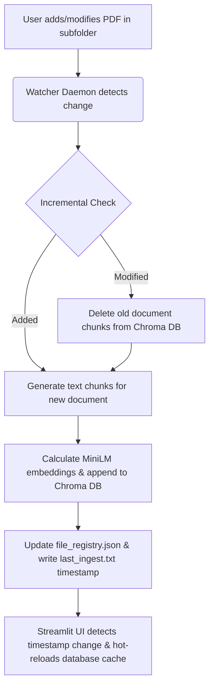

# Conversational RAG Chatbot for Civil Services Administrative Rules

An automated, incremental Retrieval-Augmented Generation (RAG) system with a localized semantic search pipeline, real-time directory hot-reloading, and conversational reasoning for Government Civil Services guidelines.

---

## A. Problem Statement (PS)

### **Problem Statement ID**: `RAG-CS-001`
### **Project Title**: Localized Conversational AI & Directory Automation for Civil Service Guidelines

### **Problem Description**
Administrative personnel in government departments routinely verify and cross-reference queries against a massive, complex, and continuously updated collection of guidelines, circulars, office memorandums, and financial rules. 
1. **Manual search latency**: Finding specific clauses in hundreds of multi-page manuals (some exceeding 100MB, like the GFR or CPWD manuals) wastes significant time.
2. **Hallucination risks**: General-purpose cloud LLMs are prone to hallucinations, cannot access local/sensitive directives, and pose security risks if internal documents are uploaded to public servers.
3. **Re-indexing overhead**: Traditional RAG systems require re-indexing the entire document corpus from scratch whenever a single file is added or modified, which is highly inefficient for large document directories.

### **Key Solution Objectives**
* **Local Processing**: Keep all computations, embeddings, and database storage entirely offline on CPU/local hardware.
* **Conversational flow with context retention**: Resolve follow-up queries by dynamically keeping track of historical message context.
* **Directory Automation**: Run a background watcher daemon to detect nested changes and update database entries incrementally.
* **Hot-Reloading UI**: Update Streamlit's in-memory retriever database automatically without requiring a server restart.

---

## B. Dataset Details

### 1. AI Dataset: Unlabeled Document Corpus
* **Format**: PDF documents (.pdf)
* **Count**: 259 source documents (excluding files over 100MB ignored in Git)
* **Logical Categorizations**:
  * `Leave, Allowances & Incentives`: Leave Rules, LTC guidelines, Casual and Special Leave policies.
  * `Pay Matters`: Pay protection, stepping up of pay, FR/SR pay fixation, and recovery guidelines.
  * `Promotion, MACP & Seniority`: MACP schemes, DPC guidelines, APAR procedures.
  * `Reservation`: Rules and timelines on reservation/dereservation for Ex-servicemen and PwBDs.
  * `Conduct & Vigilance`: CCS Conduct Rules, sexual harassment SOPs, vigilance clearances.
  * `Finance`: General Financial Rules (GFR), manual for goods/services procurement, CPWD manual.
  * `Recruitment & Probation`: Model RRs, probation policies, confirmation timelines.
  * `Retirement & Lien`: Pension rules, Voluntary Retirement Schemes (VRS), Lien guidelines.
  * `Training`: Induction training guidelines and policies.

### 2. Analytics Dataset: Metrics & Registry Data
* **File Registry (`file_registry.json`)**: An active catalog mapping PDF relative paths to their modification times (`mtime`) and byte sizes. Used to calculate incremental differentials.
* **BM25 Cache (`bm25_index.pkl`)**: Serialized pickle database storing keyword statistics and inverse document frequencies for rapid lexical retrieval.
* **Database Size**: Chroma DB vector index size is ~247MB, representing **19,341 text chunks** embedded into a 384-dimensional space.

### 3. Automation Workflow


---

## C. System Requirements & Execution

### Prerequisites
* Python 3.10+
* Local installation of Ollama (for Gemma2:9b offline model) or access to a remote vLLM endpoint.

### Installation
```bash
# Clone the repository
git clone git@github.com:dhsonu1-prog/rag-chatbot.git
cd rag-chatbot

# Create virtual environment and install packages
python3 -m venv venv
source venv/bin/activate
pip install -r requirements.txt
```

### Execution
1. **Launch Watcher Daemon**:
   ```bash
   python watcher.py
   ```
2. **Launch Chatbot UI**:
   ```bash
   streamlit run app.py
   ```
