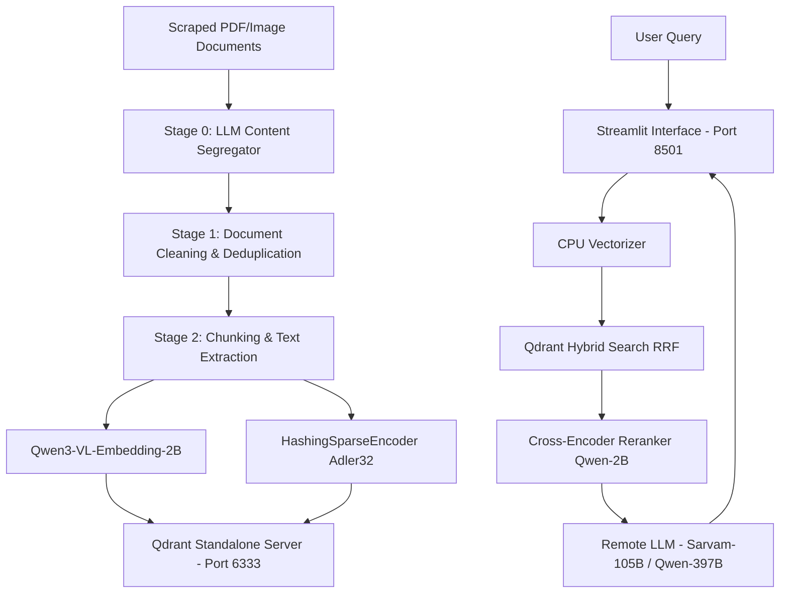

# 🛠️ RAG Chatbot Developer Guide

Welcome to the Developer Guide for the Local Civil Services Rules RAG Chatbot. This document outlines the technical architecture, environment requirements, setup instructions, and execution workflows for local development and deployment.

---

## 🏗️ Architectural Blueprint

The application employs a **Hybrid Dual-Vector RAG architecture** designed to run efficiently on workstation hardware:



### Key Optimizations:
1.  **Split Vectorization**: The ingestion pipeline runs the embedding model on the **GPU** for fast bulk processing, while the Streamlit chat app runs embedding vectorization on the **CPU** to save **5.1 GB of VRAM** and prevent GPU memory contention.
2.  **Self-Healing Batching**: If any database upsert fails (due to GPU memory limits, Qdrant's 32 MB HTTP payload size limit, or network timeouts), the batch writer automatically halves/subdivides the chunks into **sub-batches of 50** recursively.
3.  **Local Checkpointing**: Processed file states and hashes are tracked dynamically in `qdrant_db/file_registry.json`. If the pipeline is interrupted, it resumes instantly skipping all pre-indexed files.

---

## 📋 Prerequisites & Infrastructure

Before running the project, ensure you have the following services active:

### 1. Standalone Qdrant DB Container
Start Qdrant inside a Docker container with local persistence:
```bash
docker run -d --name qdrant-server \
  -p 6333:6333 \
  -p 6334:6334 \
  -v $(pwd)/qdrant_storage:/qdrant/storage \
  qdrant/qdrant
```

### 2. Local Ollama Server
If running models locally, start Ollama and pull your default models:
```bash
ollama serve
ollama pull gemma2:9b
ollama pull gemma2:2b
```

### 3. Remote Server Endpoints
Confirm connectivity to the remote GPU models:
*   **Gemma-4-Vision (OCR / OCR-fallback)**: `http://172.16.172.4:3001`
*   **Sarvam-105B (Segregation / Fast generation)**: `http://172.16.172.4:3002`
*   **Qwen-397B (Heavy policy reasoning)**: `http://172.16.172.4:3003`

---

## 🚀 Setting Up the Environment

1.  **Clone the Repository**:
    ```bash
    git clone https://github.com/dhsonu1-prog/rag-chatbot.git
    cd rag-chatbot
    ```

2.  **Create a Virtual Environment**:
    ```bash
    python3 -m venv .venv
    source .venv/bin/activate
    ```

3.  **Install Python Dependencies**:
    ```bash
    pip install -r requirements.txt
    ```

---

## 💾 Running the Ingestion Pipeline

To clean, segregate, and index your documents into the Qdrant database:

```bash
python run_pipeline.py --skip-scrape --skip-clean
```

### Argument Reference:
*   `--skip-scrape`: Skips crawling external portals and downloads (use when local files are present).
*   `--skip-clean`: Skips the duplicate document scanner and garbage file cleaner.
*   `--skip-segregate`: Skips the LLM classification check that moves PDFs to `Finance`, `Personnel`, or `Procurement`.

> [!NOTE]
> If you want to force a **complete rebuild** of the database from scratch (for example, to recover dropped chunks), delete the registry checkpoint file:
> ```bash
> rm -f qdrant_db/file_registry.json
> ```

---

## 💬 Running the Chat Server

To host the interactive Streamlit chatbot UI:

```bash
streamlit run app.py --server.address=0.0.0.0 --server.port=8501
```

Once running, access the application in your browser at: `http://localhost:8501`.

### Interface Controls:
*   **Model Source**: Toggle between **Local Ollama** (which scans your local workstation tags dynamically) and **Remote vLLM Server**.
*   **Remote Model Preset**: Choose between the fast **Sarvam-105B (Port 3002)**, the vision-capable **Gemma-4-Vision (Port 3001)**, or the heavy reasoning **Qwen-397B (Port 3003)**.
*   **Enable Reranking (Qwen3-VL)**: Reranks the top 20 retrieved candidates to the best 5 using a Cross-Encoder.
    *   *Warning*: If VRAM is full, the reranker falls back to CPU. Under high CPU load, this can add ~45 seconds of latency. Toggle this **OFF** to get <3 second retrieval speeds.
*   **Vector/BM25 Slider**: Adjusts the balance of semantic search vs. keyword search.

---

## 🛠️ Code Customizations & Extending

### Adding Custom Prompts
You can edit the prompt constraints and guidelines directly inside `query_engine.py` by modifying the `RAG_PROMPT_TEMPLATE` string:
```python
RAG_PROMPT_TEMPLATE = """You are an expert administrative assistant..."""
```

### Modifying Chunk Sizes
To adjust the text granularity, edit `ingest.py`:
```python
text_splitter = RecursiveCharacterTextSplitter(
    chunk_size=1000,
    chunk_overlap=150
)
```

### Custom Model Endpoints
You can configure new fallback endpoints in `app.py` or modify the default model URLs loaded inside `query_engine.py`'s `get_rag_chain()`.
