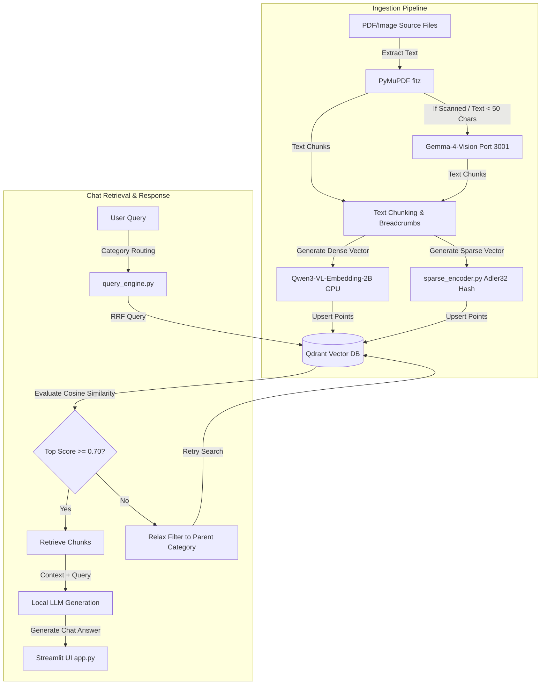

# Conversational RAG Chatbot: Project Documentation

Welcome to the **Conversational RAG Chatbot for Civil Services Administrative Rules** documentation. This guide is designed to be beginner-friendly yet technically comprehensive, explaining the system architecture, folder layout, step-by-step setup, and internal algorithms.

---

## 🌟 1. System Overview & Key Features

This application is an offline-capable, highly secure, and optimized **Retrieval-Augmented Generation (RAG)** system designed to query government guidelines, circulars, and office memorandums (OMs).

### Core Breakthroughs
*   **Single-Click Automation**: A single command triggers remote LLM-based categorization, parses digital/scanned PDFs, indexes them into Qdrant database, and starts the chatbot server.
*   **Dual Dense-Sparse Hybrid Search**: Combines semantic understanding (Dense vectors) with precise terminology matching (Sparse vectors) natively in Qdrant, using **Reciprocal Rank Fusion (RRF)**.
*   **Dynamic Fallback Routing**: If search queries in a specific subfolder yield low scores (similarity < 0.70), the engine dynamically relaxes the filter to the parent category (or global) so no relevant circulars are missed.
*   **Vision OCR Fallback**: Photocopied or scanned documents are automatically identified and sent to the `gemma-4-vision` model on Port 3001 for high-fidelity transcription.
*   **Vocabulary-Free Sparse Indexing**: Uses a deterministic **Adler32 Adler checksum** hashing trick to map alphanumeric keywords to sparse vector indices, eliminating the need to store a dictionary index file.

---

## 🏗️ 2. High-Level Architecture

The following diagram illustrates how documents are ingested and how user queries are resolved through hybrid search and routing:



---

## 📂 3. Document Directory Layout

Documents are organized into a strict, two-tier hierarchical directory under `documents/`. This hierarchy is used for category metadata filtering:

```text
documents/
├── 1_Central_Procurement_Commission/
│   ├── Procurement_Guidelines_&_GFR       # General GFR directives
│   ├── Tenders_&_Bidding                 # Tender notices, NITs
│   └── GeM_&_Contracts                   # GeM portal circulars, contract terms
├── 2_Finance/
│   ├── Demands_for_Grants                # Detailed Demands for Grants sheets
│   ├── Accounts_&_Audits                 # Ledger books, reconciliation
│   ├── General_Expenditure               # Fund releases, non-plan sanctions
│   └── Pay_&_Increments                  # Pay fixation, matrices, increments
└── 3_Personnel/
    ├── Recruitment_&_Selection           # Vacancies, Direct Recruitment, UPSC
    ├── Vigilance_Conduct_&_Discipline    # Charge sheets, CVC inquiry, POSH
    ├── Cadre_&_Promotion                 # Seniority rosters, APAR, MACP
    ├── Leave_LTC_&_Allowances            # LTC rules, maternity leaves
    ├── Retirement_&_Pension              # NPS, pension calculations, VRS
    ├── Deputation_&_Transfer             # Rotational transfers, inter-cadre
    ├── Acts_&_Central_Rules              # Legislative acts, RTI rules
    ├── Training_&_Development            # Mid-career courses, fellowships
    └── Forms_&_Annexures                 # Blank proformas and standard templates
```

---

## 🚀 4. Step-by-Step Beginner Guide

### Prerequisites
Make sure Python 3.10+ is installed and your GPU drivers are active.

### Step 1: Clone and Set Up Virtual Environment
```bash
# Navigate to project directory
cd /home/administrator/Downloads/rag-chatbot

# Activate virtual environment
source .venv/bin/activate

# Install dependencies
pip install -r requirements.txt
```

### Step 2: Running the Single-Click Pipeline
To sort all documents using LLM classification, rebuild the vector database, and start the Streamlit interface, run:
```bash
python run_pipeline.py --skip-scrape --skip-clean --start-server
```

> [!NOTE]
> *   `--skip-scrape` / `--skip-clean`: Bypasses external scraping/document sanitation.
> *   `--start-server`: Automatically boots the Streamlit application at the end of database indexing.

### Step 3: Accessing the Chatbot
Open your browser and navigate to:
**`http://localhost:8501`**

You can now start querying files!

---

## ⚙️ 5. Key Pipeline Stages & Tooling

### Phase 1: LLM-Based Document Segregation (`segregate.py`)
*   **What it does**: Reads the first page of each unsegregated PDF in `documents/`.
*   **Tool**: Calls the remote **Sarvam-105B model** (on Port 3002) with a zero-shot classification prompt.
*   **Resolution**: Moves the document to its precise category folder. If text is unreadable, it transcribes the document via **Gemma-4-Vision** (on Port 3001) first.

### Phase 2: Database Ingestion (`ingest.py`)
*   **Chunking**: Splits PDF contents into chunks of 1,000 characters with 100 characters overlap.
*   **Breadcrumbs**: Prepends directory breadcrumbs (e.g. `[Personnel -> Retirement & Pension]`) to each text chunk to ensure the model understands where the rule came from.
*   **Database**: Direct upsert to local Qdrant sqlite database storing named dense and sparse vectors under payload metadata fields: `text`, `source`, `broad_category`, and `subcategory`.

### Phase 3: Hybrid Search (`query_engine.py`)
*   **Retrieve Engine**: Performs hybrid search using Qdrant's native RRF interface.
*   **Semantic Scoring**: Compares query vector against chunk dense embeddings.
*   **Keyword Scoring**: Matches terminology using the Adler32 Chebyshev hashing sparse vector.

---

## 🔧 6. Developer & Troubleshooting Guide

### 1. SQLite Database Lock Error
**Problem**: `Error: Storage folder .../qdrant_db is already accessed by another instance of Qdrant client`
*   **Cause**: The local Qdrant engine operates in file-lock mode. If the Streamlit server is active, a running python script trying to rebuild the database will crash.
*   **Fix**: Stop the Streamlit server process (or python runner task) and retry the pipeline.

### 2. CUDA Out of Memory (OOM) Error
**Problem**: `RuntimeError: CUDA out of memory`
*   **Cause**: Running multiple python tasks (or zombie processes from aborted runs) hogging GPU memory.
*   **Fix**: Run `nvidia-smi` to find the process ID (PID) of zombie python runs, terminate them using `kill -9 <PID>`, and restart the pipeline.
